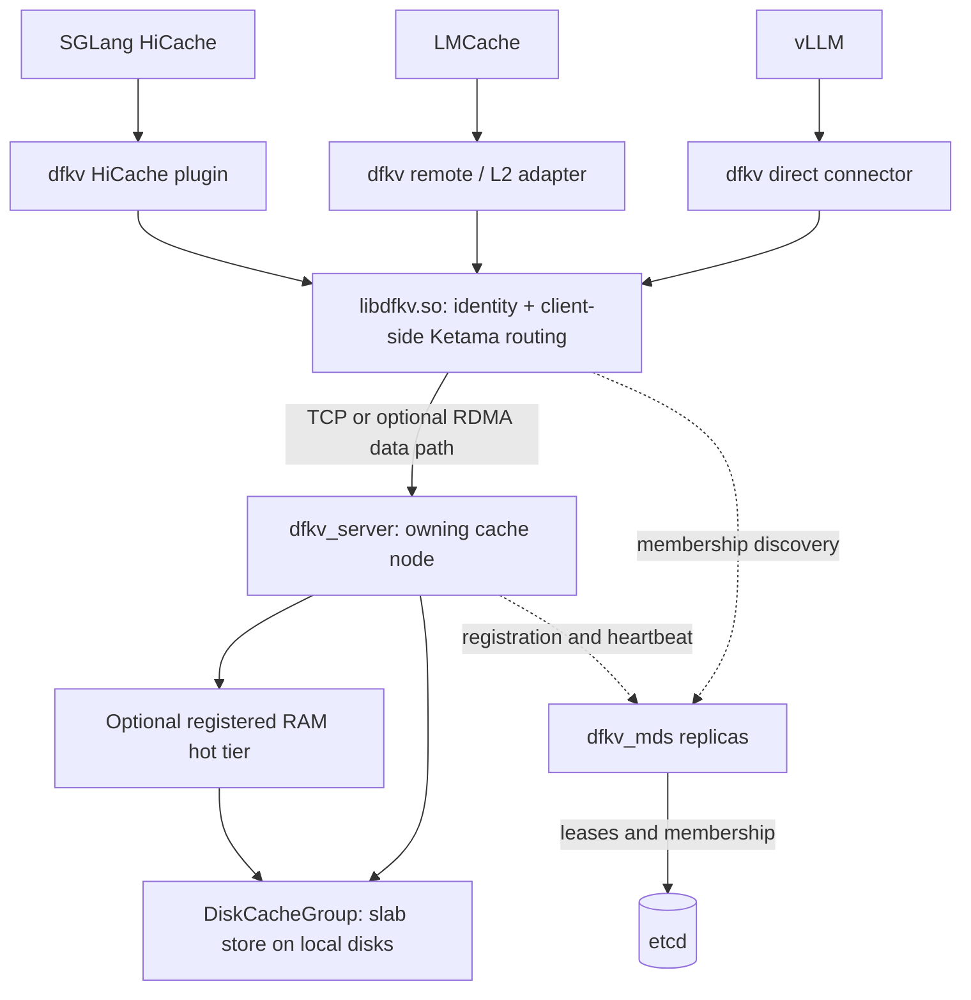

# DingoCache (dfkv)

**Share regenerable LLM KV cache across inference instances without making it permanent storage.**

[](https://github.com/dingodb/DingoCache/actions/workflows/ci.yml)
[](https://github.com/dingodb/DingoCache/releases)
[](LICENSE)

DingoCache's **dfkv** is a standalone distributed KV cache for LLM inference. Cache nodes pool local disks behind a native client that routes objects by consistent hashing. Connect [SGLang HiCache](integration/hicache/dfkv_hicache.py), [LMCache](integration/lmcache/README.md), or [vLLM directly](integration/vllm/README.md) without building a storage backend into the inference engine. It does **not** require DingoFS, brpc, or object storage; dynamic discovery uses dfkv's own membership service and etcd.

**Start here:** [Try a local cache](#try-it-locally) · [Choose an inference connector](#connect-an-inference-engine) · [Deploy a cluster](docs/DEPLOY.md) · [Explore the design](docs/ARCHITECTURE.md)

## Why dfkv?

- **Reuse cached KV across instances.** Clients use a canonical namespace and binary object key, then route to the owning node using weighted Ketama hashing. A miss is reported as a miss so the inference engine can recompute; dfkv does not claim to be a durable database.
- **Bring your own storage and transport.** The default restart-aware slab store uses bounded disk capacity and extent files instead of a file per object. TCP works without RDMA; native RDMA and an in-memory hot tier are opt-in, hardware-dependent paths.
- **Fit different inference stacks.** SGLang uses a dynamic HiCache plugin, LMCache uses its remote connector (or MP-server L2 adapter), and vLLM uses a direct `KVConnectorBase_V1` connector. All three share the `libdfkv.so` client and its raw-value contract.
- **Operate a changing ring.** Stateless `dfkv_mds` instances use etcd leases for membership; clients discover the ring and rebuild their route on placement changes. Per-node and client metrics, readiness endpoints, and `dfkvctl` help inspect it.

## Architecture at a glance



The MDS/etcd path is the **control plane**; client-to-server traffic carries cache values directly. Each server routes among its own configured disks. Multiple cache nodes share the ring but **do not replicate objects**: losing a node or changing placement can turn existing entries into misses. The RAM tier is optional; storage acknowledgment and recovery semantics depend on its configured write mode. See [architecture and defaults](docs/ARCHITECTURE.md) before relying on a particular durability boundary.

## Try it locally

This TCP-only, single-node example needs Linux x86-64 with a compatible glibc (the published release targets glibc 2.35), the release binary's runtime libraries, and at least 1 GiB of available disk space. **No GPU, RDMA hardware, MDS, or etcd is needed.** The release binary links to `libibverbs`: install the appropriate runtime package (for example `libibverbs1` on Ubuntu/Debian) even when using TCP. Use a fresh cache directory; the slab format is not a drop-in upgrade for an existing file-engine directory.

```bash
version=2.30.0
curl -fLO "https://github.com/dingodb/DingoCache/releases/download/v${version}/dfkv-${version}-linux-x86_64.tar.gz"
# Pin this release's published native asset digest before unpacking.
printf '%s  %s\n' '2e0fcec6daa1be53e7f36da50778537f9ccf8646e88a2d537cc930d335c85411' "dfkv-${version}-linux-x86_64.tar.gz" | sha256sum -c -
tar xzf "dfkv-${version}-linux-x86_64.tar.gz"
cd "dfkv-${version}-linux-x86_64"
mkdir -p dfkv-demo-cache
./bin/dfkv_server --dir "$PWD/dfkv-demo-cache" --port 12000 --cap 1073741824
```

Keep the server running; **in another terminal in the extracted directory**, write and read a sample value or run the round-trip check:

```bash
./bin/dfkvctl --members n1=127.0.0.1:12000 --namespace demo/raw-v1 put greeting hello
./bin/dfkvctl --members n1=127.0.0.1:12000 --namespace demo/raw-v1 get greeting
./bin/dfkv_smoke --members n1=127.0.0.1:12000
```

The demo uses **static membership**. For a multi-node ring, start etcd, one or more `dfkv_mds` instances, and cache nodes registered with `--mds`, `--group`, `--id`, and `--advertise`; construct clients with `mds_endpoints` and `mds_group`. Keep static `members` and dynamic MDS discovery as alternative client construction modes, not a post-open switch. Follow the [deployment runbook](docs/DEPLOY.md) for capacity planning, ports, service units, and upgrade order. The [v2.30.0 release](https://github.com/dingodb/DingoCache/releases/tag/v2.30.0) also provides Python connector wheels and `SHA256SUMS` for the complete asset set.

## Connect an inference engine

| Path | What to install/configure | Detailed setup |
| --- | --- | --- |
| **SGLang HiCache** | Load `dfkv_hicache.py` as a `dynamic` backend with `interface_v1: 1`; point it at MDS endpoints or static members and make `libdfkv.so` available. | [HiCache setup and options](docs/CONNECTORS.md) · [plugin](integration/hicache/dfkv_hicache.py) |
| **LMCache** | Install the `dfkv_common` and `dfkv_connector` wheels together with `libdfkv.so`. Use the `RemoteConnector` plugin for in-process LMCache or `DfkvL2Adapter` with the MP server. | [LMCache example](integration/lmcache/README.md) · [connector configuration](docs/CONNECTORS.md) |
| **vLLM, direct** | Install `dfkv_common` and `dfkv_vllm` with `libdfkv.so`; configure `DfkvStoreConnector` through `--kv-transfer-config`. This route **requires GPUDirect RDMA**, stable `PYTHONHASHSEED`, and `--prefix-caching-hash-algo sha256`; there is no TCP fallback. | [vLLM example and prerequisites](integration/vllm/README.md) · [connector configuration](docs/CONNECTORS.md) |

The connectors supply model/layout-aware namespaces and object keys; dfkv stores **opaque bytes**, not model-aware tensors. A different layout, dtype, or key is not automatically interoperable. See the [shared identity, environment, and per-engine guide](docs/CONNECTORS.md) before sharing cached data across processes or changing model layouts. The pure-Python connector wheels do not replace the native shared library.

## Capabilities and boundaries

- **Storage:** slab is the default; the file-per-object backend is an explicit diagnostic fallback, not an automatic recovery path. The optional RAM tier and read coalescing have separate configuration and acknowledgment semantics; see [storage and RAM design](docs/ARCHITECTURE.md).
- **Transport:** TCP is the default. RDMA requires a build with verbs support, an enabled server RDMA listener, and client `DFKV_RDMA=1`. Once RDMA is requested, incompatible or unhealthy rails fail closed rather than silently switching to TCP. [Transport and deployment details](docs/DEPLOY.md) · [client options](docs/CONNECTORS.md).
- **Consistency and failures:** no replication or backing-store fallback. Ring changes or eviction may require recomputation. A PUT whose request may already have been submitted is **not** blindly replayed across RDMA rails: its remote outcome can be ambiguous. See the [failure contract](docs/DEPLOY.md).
- **Known v2.30.0 limitation:** an intermittent server RDMA CQ *retry-exceeded* completion (status 12), observed before this release, remains unattributed. This release adds QP correlation diagnostics; it does **not** fix or suppress that error. See the [release notes](https://github.com/dingodb/DingoCache/releases/tag/v2.30.0).

## Operate and contribute

With MDS discovery, `dfkvctl ring --mds <host:port> --group <group>` shows placement, and `dfkvctl clients --mds <host:port> --group <group>` shows **registered** inference consumers (an empty list does not prove that no consumers exist). [Metrics and health endpoints](docs/METRICS.md), [observability configurations](deploy/observability/README.md), and the [deployment runbook](docs/DEPLOY.md) cover monitoring and operations. Metrics listeners are opt-in.

For development, start with the [source map and request flow](docs/ARCHITECTURE.md), then the [connector implementations](integration/) or [native client and server](src/). A local TCP build and test run needs CMake, a C++17 toolchain, and no GPU or RDMA device:

```bash
cmake -S . -B build
cmake --build build -j
ctest --test-dir build --output-on-failure
```

RDMA builds additionally need `libibverbs` development files and `-DDFKV_WITH_RDMA=ON`; the [portable release build](docs/DEPLOY.md) also enables io_uring. Open an [issue](https://github.com/dingodb/DingoCache/issues) with a reproducer or propose a focused pull request against `main`. Licensed under [Apache 2.0](LICENSE).
